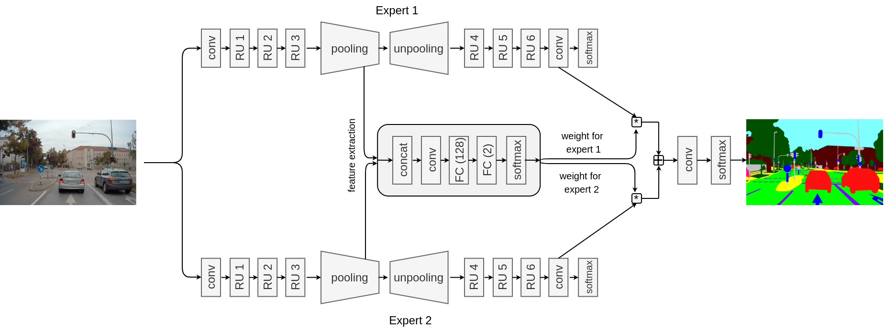
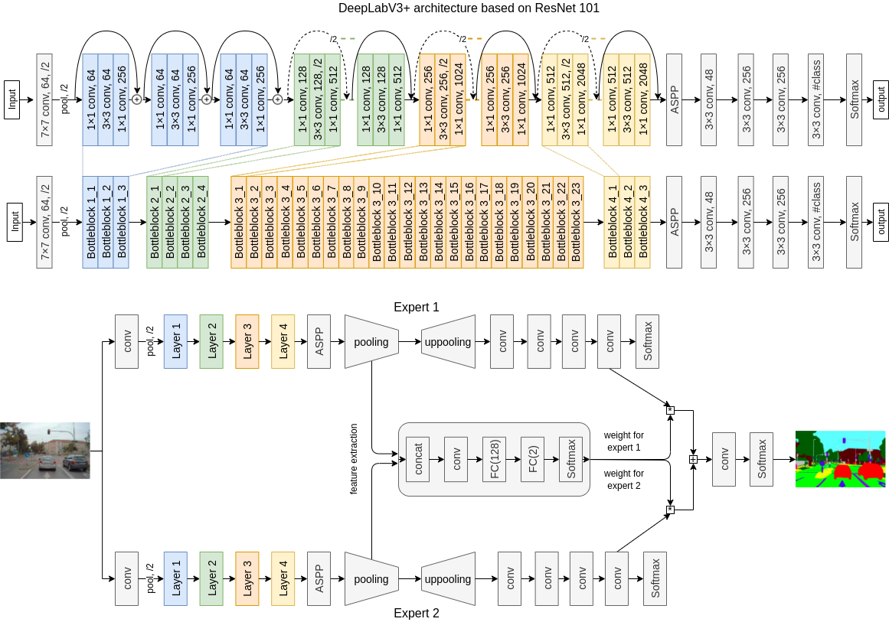

# Model-Level Mixtures of Experts for Semantic Segmentation
Mixture of experts (MoE) is a method to combine several neural networks (experts), each focused on a specific task. An additional gating network then learns to select the most suitable expert for each input, or a combination of experts. By being able to use both the overall model output as well as retaining the possibility to take into account individual expert outputs, the agreement or disagreement between those individual outputs can be used to gain insights into the decision process. Expert networks are trained by splitting the input data into semantic subsets, e.g. corresponding to different driving scenarios, to become experts in those domains. An additional gating network that is also trained on the same input data is consequently used to weight the output of individual experts. 

This repo contains a PyTorch implementation of an MoE for the semantic segmentation of traffic scenes from our ICMLA2024 paper [Towards Adversarial Robustness of Model-Level Mixture-of-Experts Architectures for Semantic Segmentation ](https://arxiv.org/abs/2412.11608). 

The code is also a PyTorch re-implementation of the TensorFlow code from our SAIAD@CVPR2020 paper [Using Mixture of Expert Models to Gain Insights into Semantic Segmentation](https://openaccess.thecvf.com/content_CVPRW_2020/papers/w20/Pavlitskaya_Using_Mixture_of_Expert_Models_to_Gain_Insights_Into_Semantic_CVPRW_2020_paper.pdf) and a follow-up paper [Evaluating mixture-of-experts architectures for network aggregation](https://library.oapen.org/bitstream/handle/20.500.12657/57375/1/978-3-031-01233-4.pdf#page=326).


The following repositories were used:
* DeepLabv3+ implementation from [this repo](https://git01lab.cs.univie.ac.at/est-gan/deeplabv3plus-pytorch)
* FRRN implementation from the [this repo](https://github.com/jcheunglin/Full-Resolution-Residual-Networks-with-PyTorch)
* Evaluation and utils from [this repo](https://github.com/jfzhang95/pytorch-deeplab-xception)

## Dataset
We used three subsets of the [A2D2 Dataset](https://www.a2d2.audi/a2d2/en/dataset.html), manually labeled according to the road type (highway/urban/ambiguous). The respective file names of ground truth are saved in text files in the `./dataloaders/a2d2_split` folder. 

The number of images in each subset is the following:

```
highway: 
	6132 train samples
	876 validation samples
	1421 test samples
urban: 
	6132 train samples
	876 validation samples
	1421 test samples
ambiguous:
	1421 test samples
```
       
## MoE Architecture
An MoE contains two experts (a highway expert and an urban expert), trained on the corresponding data subsets. 

**FRRN-based MoE** uses FRRN-A as an expert architecture. The MoE uses FRRU384 as a feature extraction layer.  The image is from [Using Mixture of Expert Models to Gain Insights into Semantic Segmentation](https://openaccess.thecvf.com/content_CVPRW_2020/papers/w20/Pavlitskaya_Using_Mixture_of_Expert_Models_to_Gain_Insights_Into_Semantic_CVPRW_2020_paper.pdf).



**DeepLabv3+-based MoE** uses DeepLabv3+ with the ResNet-101
backbone as an expert architecture. Features are extracted from the atrous spatial pyramid pooling (ASPP) layer, the last decoder layer.



## Usage
#### Training experts
Train an urban and a highway expert for MoE.

1. Modify the corresponding config files `configs/config_deeplab_expert.yaml` for the DeepLabv3+ and `configs/config_frrnA_highway.yaml` or `configs/config_frrnA_urban.yaml` or `configs/config_frrnA_baseline.yaml` for the FRRN experts
2. To train the experts: `python3 train_deeplab.py configs/config_deeplab_expert.yaml` and `python3 train_frrn.py configs/config_frrnA_urban.yaml`

#### Training an MoE
1. Add paths to the weights of the trained experts to the config files of the MoE (`configs/config_deeplab_moe.yaml` for the DeepLabv3+-based MoE and `configs/config_frrnA_moe_simple.yaml` for the FRRN-based MoE)
2. Train an MoE:  `python3 train_deeplab.py configs/config_deeplab_moe.yaml` the DeepLabv3+-based MoE and `python3 train_frrn.py configs/config_frrnA_moe_simple.yaml` for the FRRN-based MoE.

#### Evaluation  (DeepLabv3+)
For DeepLabv3+: `python3 evaluate_deeplab.py configs/config_eval_deeplab_moe.yaml`

For FRRN: `python3 evaluate_frrn.py configs/config_frrnA_moe_simple.yaml`


## Results 

Metric: mean IOU in percentage. Models were evaluated on the highway+urban test set. Experts are trained on the corresponding subsets, the baseline and MoEs are trained on combined urban+highway data.

|  Model\Dataset | FRRN-based models | DeepLabv3+-based models |
| -------------: | ------: |  ------: |
|       Baseline |  50.32 | 39.44 |
| Highway expert |  22.38 | 20.47 |
|   Urban expert |  49.63| 42.51 |
| Ensemble (mean) | 43.52 | 34.23 |
| Ensemble (max) | 45.58 | 40.79  |
|      MoE (simple gate) | 49.91 | 42.85 |
|  MoE (simple gate + conv) | 50.81   | 43.43 |
|  MoE (class-wise gate) | 50.00   | **44.35** |
| MoE (class-wise gate + conv) | **50.85**   | 44.26 |


# Citation

If you find this code useful for your research, please cite our papers:

```latex
@inproceedings{pavlitskaya2020using,
  author    = {Svetlana Pavlitskaya and
               Christian Hubschneider and
               Michael Weber and
               Ruby Moritz and
               Fabian Hüger and
               Peter Schlicht and
               J. Marius Zöllner},
  title     = {Using Mixture of Expert Models to Gain Insights into Semantic Segmentation},
  booktitle = {Conference on Computer Vision and Pattern Recognition (CVPR) - Workshops},
  year      = {2020},
}
```

```latex
@incollection{pavlitskaya2022evaluating,
  author    = {Svetlana Pavlitskaya and
               Christian Hubschneider and
               Michael Weber},
  title    = {Evaluating Mixture-of-Experts Architectures for Network Aggregation},
  booktitle    = {Deep Neural Networks and Data for Automated Driving: Robustness, Uncertainty Quantification, and Insights Towards Safety},
  year    = {2022},
  publisher    = {Springer}
}
```

```latex
@inproceedings{pavlitska2024towards,
  author    = {Svetlana Pavlitska and
               Leopold Müller and
               J. Marius Zöllner},
  title    = {Towards Adversarial Robustness of Model-Level Mixture-of-Experts Architectures for Semantic Segmentation},
  booktitle    = {International Conference on Machine Learning and Applications (ICMLA)},
  year    = {2024}
}
```
